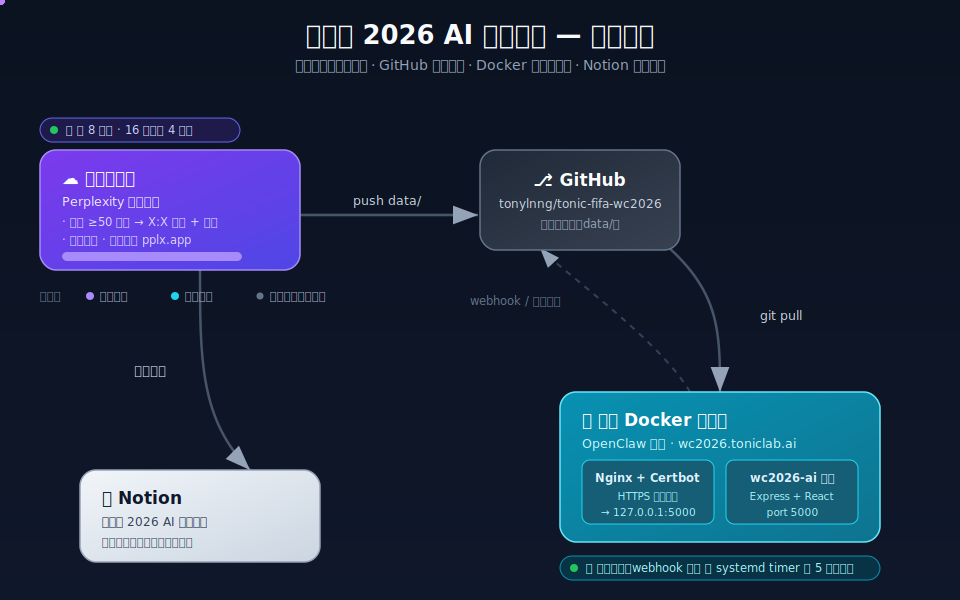

# 世界盃 2026 AI 預測中心

一個全自動的 FIFA 世界盃 2026 賽事預測系統。雲端工作區每隔數小時研究最新情報、產生 X:X 比分預測與分析理由，把資料推送到 GitHub；你的 Docker 伺服器自動拉取並展示；同時同步到 Notion 追蹤。所有使用者介面皆為**繁體中文**。

- 🌐 雲端版：<https://tonic-fifa-wc2026.pplx.app>
- 🏠 自架版：<https://wc2026.toniclab.ai>（你的伺服器）

---

## 系統架構

整套系統分四個角色，預測運算全部在雲端，你的伺服器零運算負擔、不需任何 API 金鑰。



> 上圖為 animated SVG overview（在瀏覽器 / GitHub 開啟時資料流會動）。完整技術圖表（應用架構、工作流程、狀態、循序、ER 圖、資料字典）見 [`docs/技術圖表.md`](docs/技術圖表.md)。資料流向：

```
雲端工作區（每 8 小時 · 16 強起每 4 小時）
   │  研究 ≥50 來源 → X:X 預測 + 理由 → 算準確率
   ├──→ push data/ ─────────────→ GitHub（資料中轉站）
   │                                   │
   │                                   │ 你的伺服器偵測新 commit
   │                                   ▼
   │                          你的 Docker 伺服器（git pull + 重啟容器）
   │                          Nginx + Certbot → wc2026.toniclab.ai
   │
   └──→ 同步預測 ────────────────→ Notion（預測追蹤資料庫）
```

**雙方都有定時任務：**

| 角色 | 定時任務 | 頻率 |
|------|----------|------|
| 雲端工作區 | 產生預測 → push GitHub → 同步 Notion → 重新發布 pplx.app | 每 8 小時（16 強起每 4 小時） |
| 你的伺服器 | 偵測 GitHub 新 commit → `git pull` → 重啟容器 | webhook 即時 ／ systemd timer 每 5 分鐘輪詢 |

---

## 這個項目包含什麼

| 路徑 | 用途 |
|------|------|
| `site/` | 全端網站（Express + Vite + React + Tailwind）：密碼登入、賽程 Master List、AI 預測卡（附 50+ 來源連結）、結果與準確率儀表板 |
| `site/data/fixtures.json` | 104 場賽程 Master List（48 隊分 A–L 組 + 淘汰賽路徑） |
| `site/data/results.json` | 已完成比賽的最終比分 |
| `site/data/accuracy.json` | 勝負命中率、比分命中率統計 |
| `site/data/predictions/` | 每場每批次獨立保存的預測 JSON（永不覆蓋，檔名含 run_id） |
| `Dockerfile` / `docker-compose.yml` | 自架部署用的容器設定 |
| `deploy/` | 伺服器自動拉取與重啟工具（webhook + systemd timer + Nginx 設定） |
| `update_accuracy.py` `sync_to_site.py` `push_to_github.py` | 雲端排程每輪呼叫的資料處理腳本 |
| `CRON_RUNBOOK.md` | 雲端排程每輪執行的完整手冊 |
| `automation/排程自動化總覽.md` | 整套自動化邏輯與檔案說明 |
| `docs/architecture.svg` | 上方的動態架構圖（overview） |
| `docs/技術圖表.md` | Mermaid 技術圖：應用架構 / 工作流程 / 狀態 / 循序 / ER 圖 / 資料字典 |

---

## 安裝步驟（在你的伺服器上）

> 適合用 OpenClaw 或任何能執行 shell 的環境照著跑。前置：已安裝 **Docker** 與 **Docker Compose**，且 `wc2026.toniclab.ai` 的 DNS A/AAAA 紀錄已指向這台伺服器。

### 步驟 0 — 校準系統時鐘（NTP，必做）

伺服器時鐘要準，否則 webhook 簽章驗證、timer 觸發、資料「距今多久」計算都可能出錯。

```bash
# 開啟 NTP 自動授時並確認狀態
sudo timedatectl set-ntp true
timedatectl                 # 確認 "System clock synchronized: yes" 且時區正確
# 若無 systemd-timesyncd，可裝 chrony：sudo apt install -y chrony && sudo systemctl enable --now chrony
```

### 步驟 1 — 取得程式碼並啟動容器

```bash
# clone 到 /opt（路徑可自訂，後續 deploy 工具預設用這個）
sudo git clone https://github.com/tonylnng/tonic-fifa-wc2026.git /opt/tonic-fifa-wc2026
cd /opt/tonic-fifa-wc2026

# 設定登入密碼：編輯 docker-compose.yml 的 SITE_PASSWORD
#   注意：YAML 會把 $$ 解析成一個 $。內建密碼 TN$$$$$$$$（8 個錢字號）
#   在 compose 檔內已寫成 16 個 $。改密碼時請留意此跳脫規則。

# 因為前面會放 Nginx，建議容器只綁本機（避免被繞過直接存取）：
#   把 docker-compose.yml 的 ports 改成  "127.0.0.1:5000:5000"

docker compose up -d
chmod +x deploy/update.sh deploy/webhook.py
```

此時 `http://127.0.0.1:5000` 已可在本機存取。

### 步驟 2 — 設定網域 + HTTPS（Nginx + Certbot）

```bash
# 安裝 Nginx 並啟用 server block
sudo apt install -y nginx
sudo cp deploy/nginx/wc2026.toniclab.ai.conf /etc/nginx/sites-available/
sudo ln -s /etc/nginx/sites-available/wc2026.toniclab.ai.conf /etc/nginx/sites-enabled/
sudo nginx -t && sudo systemctl reload nginx

# 申請 HTTPS 憑證（Certbot 會自動補上 443 區塊並設定自動續期）
sudo apt install -y certbot python3-certbot-nginx
sudo certbot --nginx -d wc2026.toniclab.ai
```

完成後開 <https://wc2026.toniclab.ai> 輸入密碼即可登入。

### 步驟 3 — 設定自動更新（webhook 或 timer，擇一）

讓伺服器在雲端排程 push 後自動拉取最新資料。完整說明見 [`deploy/自動部署說明.md`](deploy/自動部署說明.md)。

**方案 A — Webhook 即時觸發（推薦，秒級更新）**

```bash
# 產生密鑰（GitHub 那邊要填一樣的）
openssl rand -hex 20

sudo cp deploy/wc2026-webhook.service /etc/systemd/system/
sudo nano /etc/systemd/system/wc2026-webhook.service   # 填入上面的 WEBHOOK_SECRET
sudo systemctl daemon-reload
sudo systemctl enable --now wc2026-webhook.service
```

再把 `deploy/nginx/wc2026.toniclab.ai.conf` 裡的 `/gh-webhook` 區塊取消註解、`reload nginx`，
然後到 GitHub repo → Settings → Webhooks 新增：
- Payload URL：`https://wc2026.toniclab.ai/gh-webhook`
- Content type：`application/json`、Secret：上面的密鑰、事件選 push

**方案 B — systemd timer 定時輪詢（不需對外開埠）**

```bash
sudo cp deploy/wc2026-deploy.service /etc/systemd/system/
sudo cp deploy/wc2026-deploy.timer   /etc/systemd/system/
sudo systemctl daemon-reload
sudo systemctl enable --now wc2026-deploy.timer
systemctl list-timers wc2026-deploy.timer   # 確認下次執行時間
```

> 輪詢間隔預設 **每 15 分鐘**（`wc2026-deploy.timer` 的 `OnUnitActiveSec=15min`）。因為雲端每 8 小時（16 強起 4 小時）才更新一次，15 分鐘已綣綣有餘；要更即時可改用方案 A webhook。

---

## 更新步驟

### 平常更新（全自動，無需動手）

雲端排程每輪 push 後，伺服器會透過 webhook（秒級）或 timer（5 分鐘內）自動：
`git reset --hard` 拉最新 → 只動到 `site/data/` 就 `docker compose restart`、動到程式碼就 `docker compose up -d --build`。

### 手動更新（如要立即拉一次）

```bash
cd /opt/tonic-fifa-wc2026
REPO_DIR=/opt/tonic-fifa-wc2026 ./deploy/update.sh
```

### 更新邏輯設定（`deploy/update.sh` 環境變數）

| 變數 | 說明 | 預設 |
|------|------|------|
| `REPO_DIR` | repo 在伺服器路徑 | `/opt/tonic-fifa-wc2026` |
| `BRANCH` | 追蹤分支 | `master` |
| `COMPOSE` | compose 指令 | `docker compose`（舊版改 `docker-compose`） |
| `FORCE_REBUILD` | 設 `1` 則每次強制重新 build | `0` |
| `LOG` | 日誌路徑 | `/var/log/wc2026-deploy.log` |

---

## 驗證與排錯

```bash
docker compose ps                                  # 容器是否在跑
tail -f /var/log/wc2026-deploy.log                 # 自動更新日誌
sudo journalctl -u wc2026-webhook.service -f       # webhook 服務（方案 A）
sudo journalctl -u wc2026-deploy.service -f        # timer 執行紀錄（方案 B）
sudo nginx -t                                       # Nginx 設定檢查
sudo systemctl status certbot.timer                 # 憑證自動續期
```

---

## 雲端端（預測引擎）說明

預測產生、Notion 同步、pplx.app 重新發布由 Perplexity 雲端排程負責，**不需要在你的伺服器上跑**。
你的伺服器只讀取 GitHub 上的 `data/` 並展示。若日後想把預測引擎搬到自己環境，需自備來源蒐集與 LLM 推理管線；
本 repo 的資料處理腳本與 JSON 結構（`update_accuracy.py` / `sync_to_site.py` / `push_to_github.py`）可直接沿用。

完整每輪步驟見 [`CRON_RUNBOOK.md`](CRON_RUNBOOK.md) 與 [`automation/排程自動化總覽.md`](automation/排程自動化總覽.md)。

---

## 安全注意事項

- 登入密碼由容器的 `SITE_PASSWORD` 環境變數控制，請務必改成你自己的強密碼。
- 建議容器只綁 `127.0.0.1`，對外一律走 Nginx + HTTPS。
- Webhook 使用 HMAC-SHA256 驗證 GitHub 簽章，密鑰請妥善保管。
