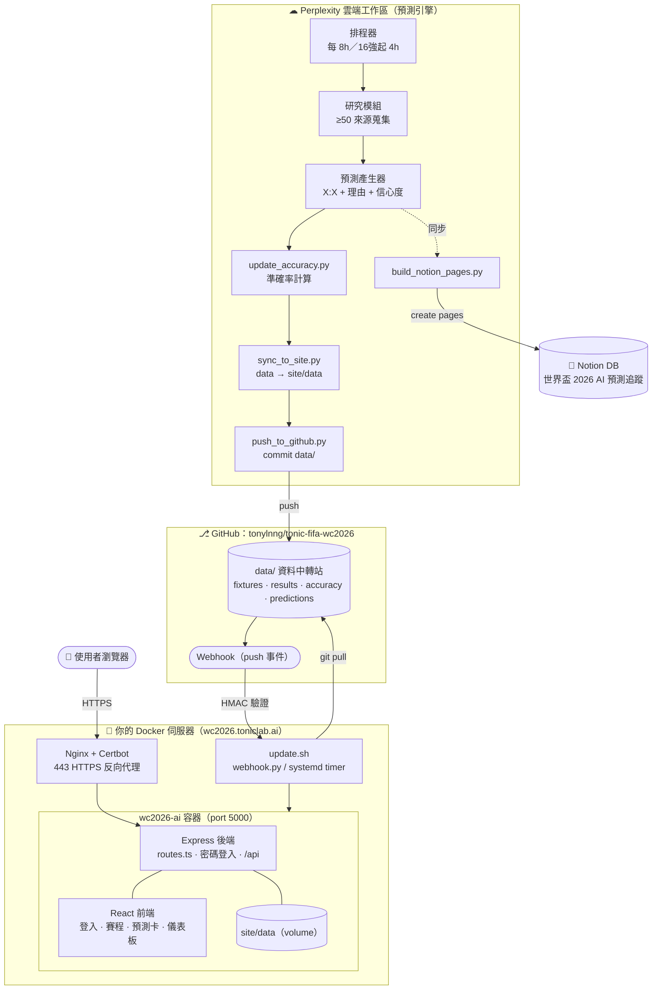
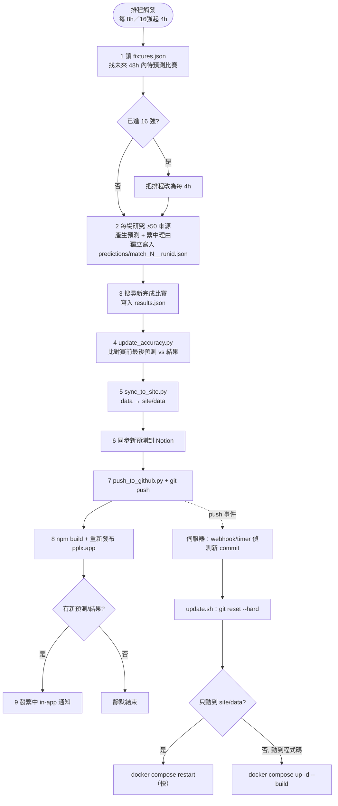
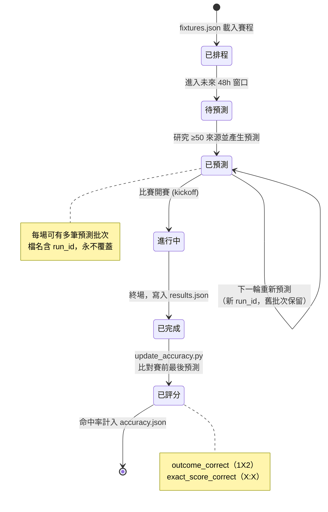
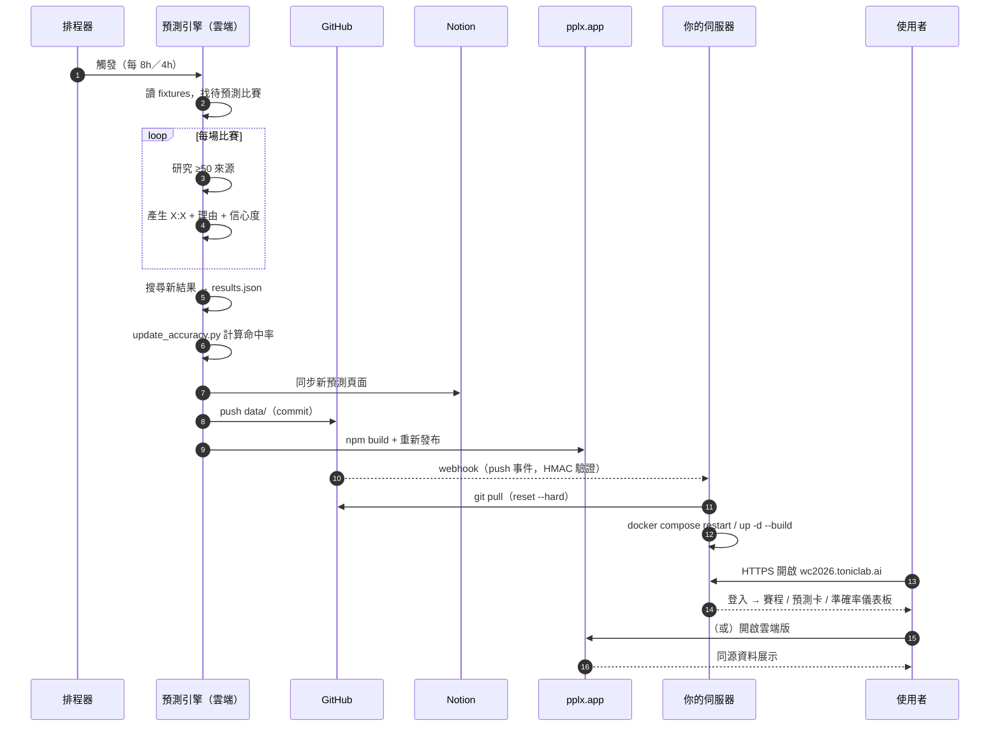
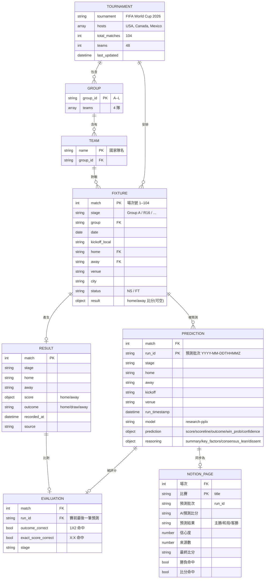

# 世界盃 2026 AI 預測中心 — 技術圖表

本文件用 [Mermaid](https://mermaid.js.org/) 描述系統的各層技術圖。GitHub 會自動渲染 Mermaid 區塊；本機可用 VS Code 的 Mermaid 外掛或 <https://mermaid.live> 預覽。

系統總覽（動態流程）見 [`docs/architecture.svg`](architecture.svg)，本文件補上技術細節：應用架構、工作流程、狀態、循序、ER 圖與資料字典。

---

## 1. 應用架構圖（Application Architecture）

各部署單元與其元件、執行時相依關係。

---

## 2. 工作流程圖（Workflow）

雲端排程每輪的 9 個步驟，以及伺服器端的更新流程。

---

## 3. 狀態圖（State Diagram）

單一比賽（match）在系統中的生命週期狀態。

---

## 4. 循序圖（Sequence Diagram）

一輪完整排程從觸發到使用者看到更新的端到端互動。

---

## 5. 實體關聯圖（ER Diagram）

資料模型以 JSON 檔案儲存（非關聯式資料庫），以下用 ER 圖表達邏輯實體與關聯。`MATCH`（場次號）是貫穿全系統的主鍵。

---

## 6. 資料字典（Data Dictionary）

### `fixtures.json` — 賽程 Master List

| 欄位 | 型別 | 說明 |
|------|------|------|
| `tournament` | string | 賽事名稱（FIFA World Cup 2026） |
| `hosts` | array\<string\> | 主辦國：USA、Canada、Mexico |
| `total_matches` | int | 總場次（104） |
| `teams` | int | 參賽隊數（48） |
| `groups` | object | 組別 → 隊伍清單（A–L，每組 4 隊） |
| `fixtures` | array\<object\> | 全部 104 場賽程，欄位見下 |
| `fixtures[].match` | int | **場次號（主鍵，1–104）** |
| `fixtures[].stage` | string | 階段（Group A、Round of 16…） |
| `fixtures[].group` | string | 組別代號（A–L；淘汰賽為空） |
| `fixtures[].date` | date | 比賽日期 `YYYY-MM-DD` |
| `fixtures[].kickoff_local` | string | 當地開賽時間 `HH:MM` |
| `fixtures[].home` / `away` | string | 主／客隊名 |
| `fixtures[].venue` / `city` | string | 球場 / 城市 |
| `fixtures[].status` | string | `NS`（未開賽）／`FT`（完場） |
| `fixtures[].result` | object\|null | 完場比分 `{home,away}`，未完場為空 |

### `predictions/match_{N}__{run_id}.json` — 單場單批次預測（永不覆蓋）

| 欄位 | 型別 | 說明 |
|------|------|------|
| `match` | int | 場次號（對應 fixtures） |
| `run_id` | string | **預測批次（主鍵，`YYYY-MM-DDTHHMMZ`）** |
| `run_timestamp` | datetime | 該輪 UTC 觸發時間 |
| `stage` / `home` / `away` | string | 階段、主隊、客隊 |
| `kickoff` / `venue` | string | 開賽時間、球場 |
| `model` | string | 預測模型標記（`research-pplx`） |
| `prediction.score` | object | `{home,away}` 預測比分（整數） |
| `prediction.scoreline` | string | 比分字串（如 `0:2`） |
| `prediction.outcome` | enum | `home` / `draw` / `away` |
| `prediction.win_prob` | object | `{home,draw,away}` 機率（合計≈1） |
| `prediction.confidence` | float | 信心度 0–1 |
| `reasoning.summary` | string | 繁中分析摘要 |
| `reasoning.key_factors` | array\<string\> | 關鍵因素（球員狀態/傷停/戰術/場地/輿論…） |
| `reasoning.consensus_lean` | string | 主流共識傾向 |
| `reasoning.dissent` | string | 反向／少數意見 |

### `results.json` — 已完成比賽結果

| 欄位 | 型別 | 說明 |
|------|------|------|
| `last_updated` | datetime | 最後更新時間（UTC） |
| `results[].match` | int | 場次號 |
| `results[].stage` | string | 階段 |
| `results[].home` / `away` | string | 主／客隊 |
| `results[].score` | object | `{home,away}` 最終比分 |
| `results[].outcome` | enum | `home` / `draw` / `away` |
| `results[].recorded_at` | datetime | 記錄時間 |
| `results[].source` | string | 結果來源 URL |

### `accuracy.json` — 滾動準確率

| 欄位 | 型別 | 說明 |
|------|------|------|
| `metrics.total_evaluated` | int | 已評分比賽數 |
| `metrics.outcome_correct` | int | 勝負（1X2）命中數 |
| `metrics.outcome_accuracy` | float | 勝負命中率（0–1） |
| `metrics.exact_score_correct` | int | 比分（X:X）命中數 |
| `metrics.exact_score_accuracy` | float | 比分命中率（0–1） |
| `by_stage` | object | 各階段分項統計 |
| `evaluations[]` | array | 每場評分明細（match / run_id / 命中與否） |

### Notion DB「世界盃 2026 AI 預測追蹤」屬性

| 屬性 | Notion 型別 | 說明 |
|------|-------------|------|
| 比賽 | title | 頁面標題 |
| 場次 | number | 場次號 |
| 階段 | select | 小組賽/32強/16強/八強/四強/季軍戰/決賽 |
| 主隊 / 客隊 | text | 隊名 |
| AI預測比分 | text | 如 `0:2` |
| 預測結果 | select | 主勝 / 和局 / 客勝 |
| 信心度 | number (percent) | 0–1 |
| 來源數 | number | 蒐集來源數量 |
| 最終比分 | text | 完場後回填 |
| 勝負命中 / 比分命中 | checkbox | 評分後回填 |
| 預測批次 | text | run_id |
| 分析摘要 | text | ≤1900 字 |
| 更新時間 | date (datetime) | ISO 時間 |

> 同步邏輯：每輪預測為每場建立新頁面；比賽完成後，結果同步會更新該場「賽前最後一筆預測」頁面的最終比分與命中欄位。
